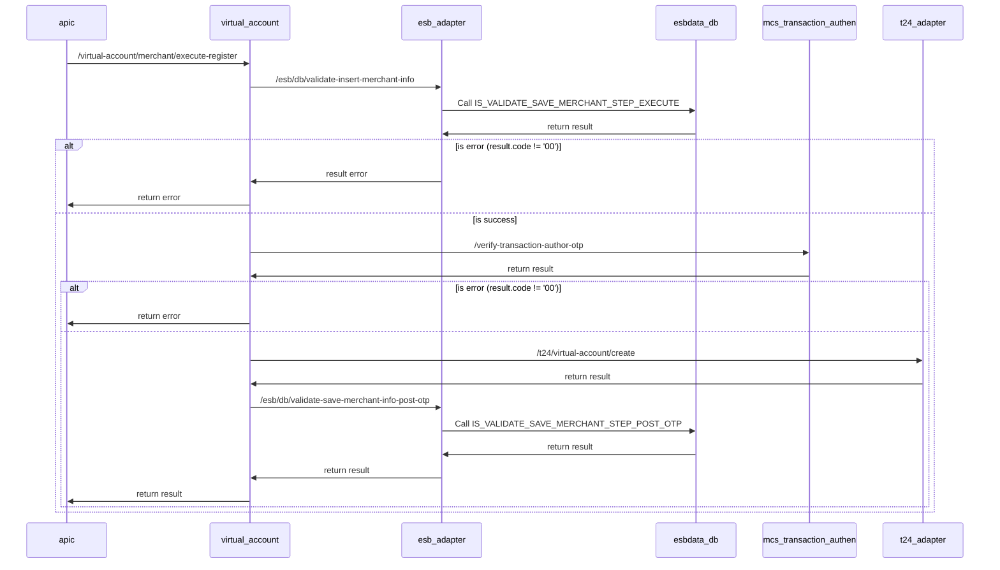

## Execute Register Merchant

- Mô tả: Xác nhận giá trị OTP và thực thi tạo merchant
- Project: Payment platform (OCB Open API) - Squad 36
- Sprint: 2.1
- BA: Hieu, Luu Huynh Trung (hieulht@ocb.com.vn); Khoa, Tran Cao Viet (khoatcv@ocb.com.vn)

## Sequence diagrams


## Mô tả chi tiết các bước xử lý:
- Bước 1: Gọi esb_adapter => /esb/db/validate-insert-merchant-info => Call SP: IS_VALIDATE_SAVE_MERCHANT_STEP_EXECUTE
    - Thông tin store procedure
        - INPUT:
      
          ```xml
          <INPUT>
              <transID>string</transID>
              <registerTransId>string</registerTransId>
              <channel>string</channel>
              <clientTransId>string</clientTransId>
              <clientTimestamp>string</clientTimestamp>
              <requestBody>string</requestBody>
              <userName>string</userName>
          </INPUT>
          ```
        - OUTPUT:
      
          ```xml
            <result>
              <resultCode>string</resultCode>
              <resultMsg>string</resultMsg>
              <mcsCode>string</mcsCode>
              <mcsMsg>string</mcsMsg>
              <registerTransId>string</registerTransId>
              <partnerCif>string</partnerCif>
              <merchantEBUsername>string</merchantEBUsername>
              <merchantT24IdNumber>string</merchantT24IdNumber>
              <subId>string</subId>
              <virtualAccountName>string</virtualAccountName>
              <merchantBankAccount>string</merchantBankAccount>
              <merchantCif>string</merchantCif>
              <merchantName>string</merchantName>
              <merchantAddress>string</merchantAddress>
              <mobilePhone>string</mobilePhone>
              <oldVaAccountNumber>string</oldVaAccountNumber>
              <oldBankAccount>string</oldBankAccount>
              <action>string</action>
            </result>
          ````

- Bước 2: Nếu result.code != '00' ? trả về lỗi: mcsCode, mcsMsg  : bước 3

- Bước 4: Gọi mcs-transaction-authentication => /verify-transaction-author-otp => Nếu verify thành công ? bước 5 : trả về lỗi

- Bước 5: Gọi T24 Adapter =>  /t24/virtual-account/create

- Bước 6: Gọi esb_adapter => IS_VALIDATE_SAVE_MERCHANT_STEP_POST_OTP => trả về kết quả
    - Thông tin store procedure
        - INPUT:
        
          ```xml
          <INPUT>
              <transID>string</transID>
              <status>string</status>
              <T24Request>string</T24Request>
              <T24Response>string</T24Response>
              <vaAccountNumber>string</vaAccountNumber>
              <registerTransId>string</registerTransId>
          </INPUT>
          ```
        - OUTPUT:
        
          ```xml
            <result>
              <resultCode>string</resultCode>
              <resultMsg>string</resultMsg>
              <mcsCode>string</mcsCode>
              <mcsMsg>string</mcsMsg>
            </result>
          ```


### Result code:
- 00: Thành công
- 01: Data not found / Không tìm thấy dữ liệu
- 2007: Thông tin request không hợp lệ
- 9999: Lỗi nghi vấn
- 99: Lỗi không xác định

#### Note:
````
  - Lưu ý dùng User kết nối DB riêng cho hệ thống NewMCS đến OCBCHANNEL DB và ESBDATA DB
  - Thông tin config kết nối DB trong file .yaml của channel-adapter và esb-adapter như sau:
	datasource:
	  ocbchannel/esbdata:
	    host:
		port:
		service-name:
		username:
		password:
		max-pool-size:
		connection-timeout:
		idle-timeout:
		max-life-time
````
