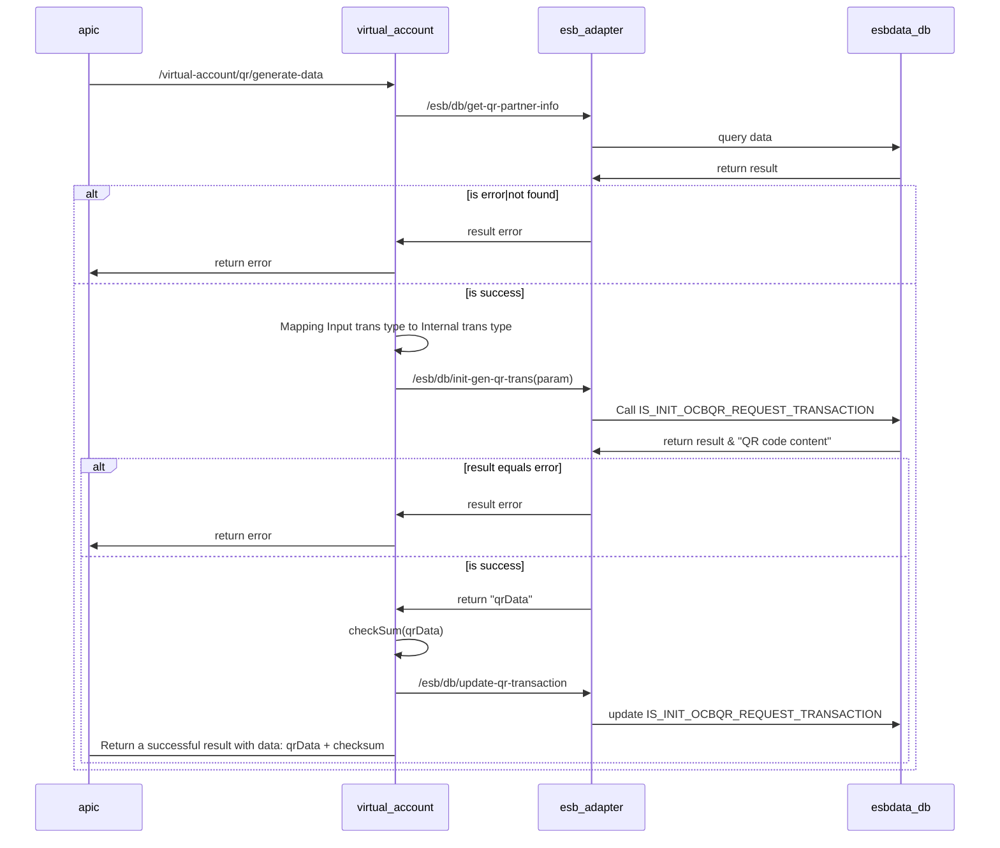

## Generate QR Data

- Mô tả: Tạo Qr Data (BILL_NUMBER/ VIRTUAL_ACCOUNT/ CURRENT_ACCOUNT)
- Project: Payment platform (OCB Open API) - Squad 36
- Sprint: 2.1
- BA: Hieu, Luu Huynh Trung (hieulht@ocb.com.vn); Khoa, Tran Cao Viet (khoatcv@ocb.com.vn)

## Sequence diagrams


## Mô tả chi tiết các bước xử lý:
- Bước 1: Gọi esb_adapter => /esb/db/get-qr-partner-info, kiểm tra thông tin đăng ký QR partner info => tồn tại ? bước 2 : trả về lỗi 
    ````
    SELECT U.CIF
    FROM
        EB_USERS U INNER JOIN OCBQR_PARTNER QP
        ON U.CIF = QP.APIC_CIF_REGISTERD
    WHERE
        QP.STATUS = 1 AND U.USER_NAME = $UserName
    ````
- Bước 2: Gọi esb_adapter => /esb/db/init-gen-qr-trans(param) => Call SP: IS_INIT_OCBQR_REQUEST_TRANSACTION
  - Thông tin store procedure
    - INPUT:
    
      ```xml
      <INPUT>
        <transId>c50c6d0d-db7c-4d5c-a83c-c017b5dff4ee</transId> => sid
        <partnerTransId/> => cid
        <transType>NAPAS_QR_TRANSFER</transType> => beneficiaryAccountType
        <amount/>  => transactionAmountNumber
        <remarks/> => transactionDescription
        <creditAccount/> => beneficiaryAccountNumber
        <channel/> => APIC
        <billCode/>  => beneficiaryAccountNumber
        <partnerCif/> => lấy cif từ bước 1
        <vaId/> => vaId
        <additionalInfo> => additionalInfo
          <items>
            <name>string</name>
            <value>string</value>
          </items>
          <items>
            <name>string</name>
            <value>string</value>
          </items>
        </additionalInfo>
      </INPUT>
      ```
    - OUTPUT:
    
      ```xml
      <result>
        <resultCode>00</resultCode>
        <resultMsg>Success</resultMsg>
        <details>string</details>
        <qrCodeData>string</qrCodeData>
        <qrCodeTransId>string</qrCodeTransId>
      </result>
      ```
      
    - Mapping transaction type:
    
      ````
      BILL_NUMBER => BILL_PARTNER_VIETQR
      VIRTUAL_ACCOUNT => MERCHANT_PARTNER_VIETQR_TRANSFER
      CURRENT_ACCOUNT => NAPAS_QR_TRANSFER
      ````
  
- Bước 3: thực hiện checkSum(qrData) nhận được từ SP, tạo qrData mới = qrData + chuỗi checkSum
  + Bước 3.1: Gọi esb-adapter: /esb/db/update-qr-transaction để update chuỗi qrData có check sum => bước này không cần đợi kết quả, chỉ cần ghi log

    ````
    update OCBQR_REQUEST_TRANSACTION
    set QRDATA = $qrData_with_check_sum
    where OCB_TRANS_ID = $sid;  
    ````
  
  + Bước 3.2: trả về response thành công với qrData có check sum

## Result code:
- 00: Thành công
- 01: Data not found / Không tìm thấy dữ liệu
- 2007: Thông tin request không hợp lệ
- 9999: Lỗi nghi vấn
- 99: Lỗi không xác định

## Note:
````
  - Lưu ý dùng User kết nối DB riêng cho hệ thống NewMCS đến OCBCHANNEL DB và ESBDATA DB
  - Thông tin config kết nối DB trong file .yaml của channel-adapter và esb-adapter như sau:
	datasource:
	  ocbchannel/esbdata:
	    host:
		port:
		service-name:
		username:
		password:
		max-pool-size:
		connection-timeout:
		idle-timeout:
		max-life-time
````
