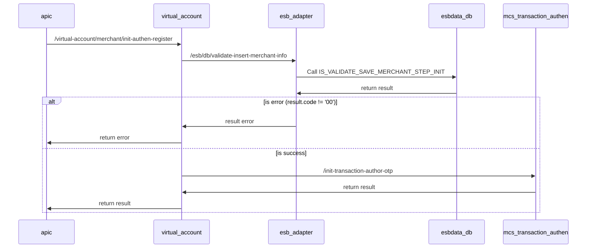

## Init Authen Register Merchant

- Mô tả: Khởi tạo yêu cầu tạo merchant và gửi OTP theo hình thức xác thực đã đăng ký
- Project: Payment platform (OCB Open API) - Squad 36
- Sprint: 2.1
- BA: Hieu, Luu Huynh Trung (hieulht@ocb.com.vn); Khoa, Tran Cao Viet (khoatcv@ocb.com.vn)

## Sequence diagrams


## Mô tả chi tiết các bước xử lý:
- Bước 1: Gọi esb_adapter => /esb/db/validate-insert-merchant-info => Call SP: IS_VALIDATE_SAVE_MERCHANT_STEP_INIT
    - Thông tin store procedure
        - INPUT:
      
          ```xml
            <INPUT>
              <transID>string</transID>
              <clientTransId>string</clientTransId>
              <clientTimestamp>string</clientTimestamp>
              <idNumber>string</idNumber>
              <bankAccountNumber>string</bankAccountNumber>
              <requestBody>string</requestBody>
              <partnerCustomerName>string</partnerCustomerName>
              <email>string</email>
              <customerName>string</customerName>
              <merchantName>string</merchantName>
              <mcc>string</mcc>
              <merchantAddress>string</merchantAddress>
              <subId>string</subId>
              <channel>string</channel>
              <action>string</action>
              <oldVaAccountNumber>string</oldVaAccountNumber>
              <userName>string</userName>
            </INPUT>
          ```
          
        - OUTPUT:
      
          ```xml
            <result>
              <resultCode>string</resultCode>
              <resultMsg>string</resultMsg>
              <mcsCode>string</mcsCode>
              <mcsMsg>string</mcsMsg>
              <merchantCif>string</merchantCif>
              <merchantEBUsername>string</merchantEBUsername>
            </result>
          ```

- Bước 2: Nếu result.code != 'SUCCESS' ? trả về lỗi: mcsCode, mcsMsg : bước 3

- Bước 4: Gọi mcs-transaction-authentication => /init-transaction-author-otp => trả về kết quả

### Result code:
- 00: Thành công
- 01: Data not found / Không tìm thấy dữ liệu
- 2007: Thông tin request không hợp lệ
- 9999: Lỗi nghi vấn
- 99: Lỗi không xác định

#### Note:
````
  - Lưu ý dùng User kết nối DB riêng cho hệ thống NewMCS đến OCBCHANNEL DB và ESBDATA DB
  - Thông tin config kết nối DB trong file .yaml của channel-adapter và esb-adapter như sau:
	datasource:
	  ocbchannel/esbdata:
	    host:
		port:
		service-name:
		username:
		password:
		max-pool-size:
		connection-timeout:
		idle-timeout:
		max-life-time
````
