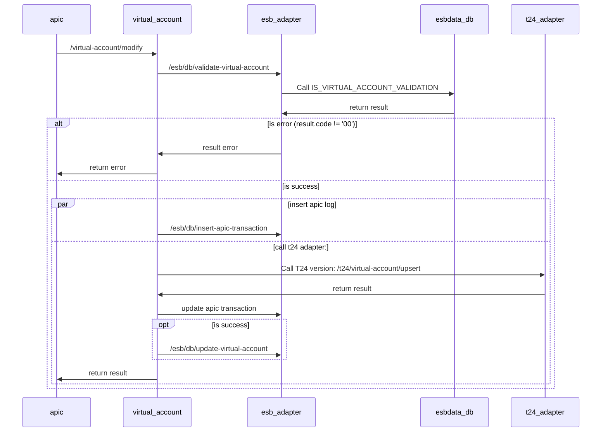

## Modify Virtual Account 1

- Mô tả: Tạo tài khoản định danh
- Project: Payment platform (OCB Open API) - Squad 36
- Sprint: 2.1
- BA: Hieu, Luu Huynh Trung (hieulht@ocb.com.vn); Khoa, Tran Cao Viet (khoatcv@ocb.com.vn)

## Sequence diagrams


## Mô tả chi tiết các bước xử lý:
- Input API:

    ````
    /virtual-account/modify => dùng chung cho: MODIFY/CLOSE/REACTIVE
    input:
    - vaId
    - subId
    - oldVaName
    - newVaName
    - action: MODIFY/CLOSE/REACTIVE
    ````
  
- Bước 1: Gọi esb_adapter => /esb/db/validate-virtual-account => Call SP: IS_VIRTUAL_ACCOUNT_VALIDATION
    - Thông tin store procedure
        - INPUT:
      
          ```xml
            <INPUT>
              <userName>string</userName>
              <vaId>string</vaId>
              <subId>string</subId>
              <vaName>string</vaName>
              <action>CREATE/MODIFY/CLOSE/REACTIVE</action>
              <sid>string</sid>
              <channel>string</channel>
            </INPUT>
          ```
        - OUTPUT:
        
          ```xml
          <result>
            <resultCode>00</resultCode>
            <resultMsg>Success</resultMsg>
            <details>string</details>
          </result>
          ```

- Bước 2: Nếu result.code != '00' ? trả về lỗi : bước 3

- Bước 3: Gọi esb_adapter => /esb/db/insert-apic-transaction => insert request, response vào table APIC_TRANSACTIONS

- Bước 4: Gọi T24 Adapter => /t24/virtual-account/upsert

    ```` 
    *action: field truyền từ APIC để xác định hành động
  
    Nếu action = "MODIFY" thì input vào t24 adapter:
     - OFS: OCBH.SUB.VIRTUAL.ACCOUNT,ESB.INP/I/PROCESS//,ESB.OUT/******////,QRP000937603432294,VA.ID:1:1=QRP,SUB.ID:1:1=000937603432294,SUB.VA.NAME:1:1=JOYME
     - Mapping OFS:
        + QRP000937603432294 => vaId + subId
        + VA.ID => vaId
        + SUB.ID => subId
        + SUB.VA.NAME => newVaName
        
    Nếu action = "CLOSE"
     - OFS: OCBH.SUB.VIRTUAL.ACCOUNT,ESB.INP/I/PROCESS//,ESB.OUT/******////,QRP000937603432294,VA.ID:1:1=QRP,SUB.ID:1:1=000937603432295,SVA.STATUS:1:1=Inactive
     - Mapping OFS:
        + QRP000937603432294 => vaId + subId
        + VA.ID => vaId
        + SUB.ID => subId
        + SVA.STATUS => Inactive
    
    
    Nếu action = "REACTIVE"
     - OFS: OCBH.SUB.VIRTUAL.ACCOUNT,ESB.INP/I/PROCESS//,ESB.OUT/******////,QRP000937603432294,VA.ID:1:1=QRP,SUB.ID:1:1=000937603432295,SVA.STATUS:1:1=Active
     - Mapping OFS:
        + QRP000937603432294 => vaId + subId
        + VA.ID => vaId
        + SUB.ID => subId
        + SVA.STATUS => Active 
    ````

- Bước 5: Gọi esb_adapter => /esb/db/update-virtual-account-info => Call SP: IS_UPDATE_VIRTUAL_ACCOUNT_INFO
    - Thông tin store procedure
        - INPUT:
      
          ```xml
          <INPUT>
            <virtualAccount>string</virtualAccount> Số tài khoản định danh đầy đủ
            <bankAccountNumber>string</bankAccountNumber>
            <virtualAccountStatus>string</virtualAccountStatus>
            <vaName>string</vaName>
            <action>CREATE/MODIFY/CLOSE/REACTIVE</action>
            <sid>string</sid>
            <channel>string</channel>
          </INPUT>
          ```
        - OUTPUT:
      
          ```xml
          <result>
            <resultCode>00</resultCode>
            <resultMsg>Success</resultMsg>
            <details>string</details>
          </result>
          ```

### Result code:
- 00: Thành công
- 01: Data not found / Không tìm thấy dữ liệu
- 2007: Thông tin request không hợp lệ
- 9999: Lỗi nghi vấn
- 99: Lỗi không xác định

#### Note:
````
  - Lưu ý dùng User kết nối DB riêng cho hệ thống NewMCS đến OCBCHANNEL DB và ESBDATA DB
  - Thông tin config kết nối DB trong file .yaml của channel-adapter và esb-adapter như sau:
	datasource:
	  ocbchannel/esbdata:
	    host:
		port:
		service-name:
		username:
		password:
		max-pool-size:
		connection-timeout:
		idle-timeout:
		max-life-time
````
